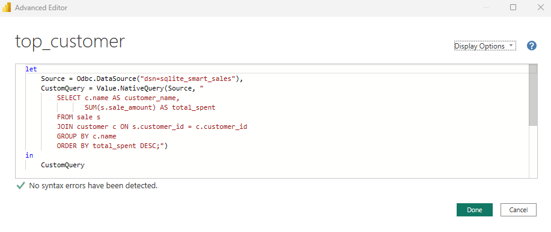

# Project Title
Smart Store Project - Kiruthikaa

## Table of Contents
- Introduction
- Project Goals
- Technologies Used
- Features
- Folder Structure
- Setup Instructions
- Commands & Workflow
- Acknowledgements
- Future Enhancements

## Introduction
This project focuses on building a smart store solution using modern tools and techniques. The implementation includes logging functionality, Python scripting, and data preparation.

## Project Goals
- Analyze customer and sales data.
- Build predictive models for forecasting.

## Technologies Used
- Python
- Pandas
- Jupyter Notebook

## Features
Project initialization with Git and virtual environment.
Centralized logging utility (logger.py) for tracking script execution.
Python scripts for data preparation and workflow automation focuses mainly on the below features. 
- **Efficient Inventory Tracking**: Manage stock levels with ease.
- **User-Friendly Interface**: Automated and easy to use.
- **Scalable Design**: Versatile to suit all business size. 

## Folder Structure
```
smart-store-kiruthikaa/
│
├── README.md              # Project documentation  
├── data/                  # Placeholder for datasets  
├── notebooks/             # Jupyter notebooks  
├── scripts/               # Python scripts like data_prep.py  
├── utils/                 # Utility scripts like logger.py  
└── .gitignore             # Git ignore file  
```

## Setup Instructions - Week 1 & Week 2
1. Clone the repository.
2. Navigate to the project folder . 
3. Create a virtual environment
4. Activate the virtual environment
5. Install dependencies using `pip install -r requirements.txt`.

```bash
# Clone the repository
git clone https://github.com/Kiruthikaa2512/smart-store.git

# Navigate to the project folder
cd smart-store-kiruthikaa

# Create a virtual environment
python -m venv .venv

# Activate the virtual environment (Windows)
.\.venv\Scripts\activate

# Install dependencies
pip install -r requirements.txt
```
## Data Collection, Cleaning, & ETL/ELT - Week 3
## Data Cleaning Process and Commands 

The data cleaning pipeline now integrates a modular class-based approach using the `DataScrubber` class. This addition streamlines data preparation tasks while ensuring maintainability and reusability across different datasets. Below is a detailed outline:

### Data Scrubber Class

The `DataScrubber` class, implemented in the project, encapsulates various data cleaning functionalities and provides a unified interface for handling datasets. It is designed to be flexible and scalable for diverse cleaning needs.

### Key Features of `DataScrubber`

- **Column Validation**: Ensures required columns are present before processing.
- **Duplicate Removal**: Removes redundant rows to improve data integrity.
- **Data Standardization**: Handles typos, formats dates, and standardizes numeric fields.
- **Outlier Detection and Removal**: Identifies and removes data anomalies.
- **Missing Value Handling**: Imputes or removes missing values based on context.
- **Customizable Rules**: Allows defining dataset-specific cleaning rules.

### Example Workflow Using `DataScrubber`

1. **Initialization**: The class is initialized with dataset-specific configurations.
2. **Execution**: Methods are called to perform step-by-step cleaning.
3. **Output**: Cleaned data is returned or saved as needed.

### Example Script Integration

The `DataScrubber` class is utilized in the individual preparation scripts:

1. **`prepare_customers_data.py`**:
   - Removes duplicate customers.
   - Standardizes names and formats `JoinDate`.
   - Aggregates loyalty points.

   Example Usage:
   ```python
   from scripts.data_scrubber import DataScrubber

   scrubber = DataScrubber(custom_rules={"customerid": "mandatory"})
   cleaned_data = scrubber.clean(customers_data)

### Core Scripts in the Data Scrubbing Workflow
The `data_prep.py` script is responsible for cleaning and preprocessing datasets for the Smart Store Project. Below is a detailed outline of the commands used:

#### 1. Read Raw Data
Reads raw CSV files and standardizes column names to ensure consistency:

df = pd.read_csv(file_path)  # Load the CSV file
df.columns = df.columns.str.strip().str.lower()  # Standardize column names

### 2. Remove duplicate Rows
df = df.drop_duplicates()  # Remove redundant rows

### 3. Handle Missing Rows
df = df.drop_duplicates()  # Remove redundant rows
df = df.dropna(subset=["customerid", "saledate"])  # Remove invalid rows

### 4. Correct Typos and Standardize Values
df['paymenttype'] = df['paymenttype'].str.capitalize().replace({"Dbit": "Debit"})
Fixes supplier typos (e.g., "Blooom" becomes "Bloom"):
df['supplier'] = df['supplier'].replace({"Blooom": "Bloom"})
Replaces invalid names in customers_data.csv
df['name'] = df['name'].str.strip().replace({"Xys": "Anonymous", "Unknown": "Anonymous"}).fillna("Anonymous")

### 5.Standardize Date Formats
df['saledate'] = pd.to_datetime(df['saledate'], errors='coerce').dt.strftime('%Y-%m-%d')
df = df.dropna(subset=['saledate'])  # Remove rows with invalid dates

### 6.Filter Outliers
For SaleAmount
df = df[(df['saleamount'] > 0) & (df['saleamount'] <= 8000)]  # Valid range
For StockQuantity
df['stockquantity'] = pd.to_numeric(df['stockquantity'], errors='coerce').fillna(0)
df = df.loc[(df['stockquantity'] >= 0) & (df['stockquantity'] <= 1500)]  # Excludes outliers
Ensure BonusPoints
df.loc[df['bonuspoints'] < 0, 'bonuspoints'] = 0

### 7.Aggregate Data
Groups and aggregates customer data to consolidate duplicate entries:
df = df.groupby('name', as_index=False).agg({
    'customerid': 'first',
    'loyaltypoints': 'sum',
    'joindate': 'first'
})

### 8.Save Cleaned Data
Saves cleaned datasets to the data/prepared directory:
df.to_csv(file_path, index=False)  # Save cleaned CSV

### Workflow commands for data cleaning process
# Execute the data cleaning script
python scripts/data_prep.py

# View logs to track data cleaning progress
tail -f utils/logger.log

### Key Issues Confirmed in This Script
Here are the exact problems we encountered in the data_prep.py script initially:

1. Missing Required Columns in products_data.csv
Error:

plaintext
Copy
Edit
KeyError: "Missing required columns in products_data.csv: {'price'}"
Fix:

Added a check before processing to validate required columns ('price', 'ProductName', etc.).

Converted column names to lowercase before checking.

2. Column Name Inconsistencies
Issue: Columns had leading/trailing spaces or inconsistent casing ("Price" vs. "price").

Fix: Used

python
Copy
Edit
df.columns = df.columns.str.strip().str.lower()
to standardize all column names.

3. Duplicate Data
Issue: Some datasets contained duplicate rows.
Fix: Used df.drop_duplicates() to remove them.

4. Missing Critical Data in customers_data.csv
Issue: CustomerID or Name was missing in some rows.
Fix: Dropped rows with missing values in these columns.

5. Date Formatting Issues in sales_data.csv
Issue: SaleDate had inconsistent formats and invalid values.
Fix: Used

## Commands & Workflow
```bash
```
# Data Warehousing, Star Schemas, & Decision Support - Week 4

## **Data Warehousing & ETL Pipeline**

#### **Overview**
As part of the Smart Store project, this week we implemented a **Data Warehouse** using a **star schema** to enable efficient data analysis and decision support. The ETL pipeline was designed to extract, transform, and load data into the database, ensuring high-quality data ingestion for actionable insights.

#### **Star Schema Design**
The star schema consists of:
- **Fact Table (`sale`)**:
  - Central table capturing transactional data like `sale_amount`, `sale_date`, and `campaignid`.
  - Linked to dimension tables using foreign keys (`customer_id`, `product_id`).
- **Dimension Tables**:
  - **`customer`**: Attributes such as `name`, `region`, and `loyaltypoints`.
  - **`product`**: Product-specific details including `product_name`, `category`, and `unitprice`.

**Schema Representation**:
```
                customer
                   ↑
                   |
    product ←— sale → store, campaign
```
#### **ETL Pipeline Process**
- **Data Preprocessing**:
  - Corrected IDs to ensure uniqueness and consistency.
  - Handled missing values by replacing NaN with logical defaults (e.g., `0` for numbers, `"Unknown"` for text).
  - Deduplicated rows to maintain data integrity.
- **Schema Creation**:
  - Generated tables (`customer`, `product`, `sale`) in SQLite based on the star schema.
- **Data Loading**:
  - Ingested cleaned data from CSV files into the database for downstream analysis.
- 
#### **Steps to Execute**
1. Ensure cleaned CSV files are placed in `data/prepared/`:
   - `customers_data_prepared.csv`
   - `products_data_prepared.csv`
   - `sales_data_prepared.csv`
2. Run the ETL pipeline:
   ```bash
   python scripts/etl_to_dw.py
   ```
3. Verify the data and relationships using SQL queries:
   ```sql
   SELECT * FROM customer LIMIT 5;
   SELECT * FROM product LIMIT 5;
   SELECT * FROM sale LIMIT 5;

   SELECT s.sale_id, c.name, p.product_name, s.sale_amount
   FROM sale s
   JOIN customer c ON s.customer_id = c.customer_id
   JOIN product p ON s.product_id = p.product_id
   LIMIT 5;
4. Output should appear as show below for each table:
  
  
  

   ```
#### **Challenges Encountered**
- **Column Mapping Issues**:
  -Certainly! Here's the modified section, focusing on the hardest challenge we encountered:
- **Foreign Key Validation Issues**:
  - **Problem**: Ensuring that the `sale` fact table's foreign keys matched valid entries in the `customer` and `product` dimension tables was particularly challenging due to missing or invalid keys.
  - **Solution**: Validated relationships between tables and used surrogate keys (e.g., `-1`) for unknown values to maintain database integrity.
- **Misaligned Schema Design**:
  - Solution: Designed a star schema with as the fact table and dimension tables
- **ETL Pipeline Misalignment**:
  - Solution:  implemented modular ETL steps to clean, validate, and load data correctly.   

# Reporting with Power BI  - Week 5
This week, I focused on creating dynamic and insightful visuals using Power BI, aimed at understanding sales trends and customer behavior effectively. My efforts were centered around building a dashboard that combines interactivity, clarity, and meaningful insights.

### **Visuals Created**
1. **Bar Chart for Top Customers**:
   - Displays the top customers based on total spending. This is the only query used for this reporting activity. 
   - Helps identify high-value customers who drive revenue.
   - **Challenge Encountered**: While working on this visual, I faced a data aggregation challenge. To resolve this, I refined the query using Power Query's M language. I grouped data by customer names, aggregated their total spending, and sorted it in descending order to display only the top N customers. Here’s the solution:
     ```m
     let
         GroupedData = Table.Group(SalesTable, {"Customer Name"}, {{"Total Spending", each List.Sum([Spending]), type number}}),
         SortedData = Table.Sort(GroupedData, {{"Total Spending", Order.Descending}}),
         TopCustomers = Table.FirstN(SortedData, 10)
     in
         TopCustomers
     ```
     Screenshot of Top_Customer Query. 
     

   - **Outcome**: The bar chart dynamically displays the top 10 customers by spending, providing key insights at a glance.

2. **Line Chart for Sales Trends**:
   - Shows monthly sales trends across different product categories.
   - Provides a detailed view of fluctuations in sales performance over time.

3. **Slicer for Product Categories**:
   - Enables interactive filtering by product categories like Clothing, Electronics, and Sports.
   - Enhances the dashboard’s ability to focus on specific segments dynamically.


### **Dashboard Explanation**
The dashboard combines all visuals onto a single page for a cohesive and interactive experience:
- **Bar Chart**: Positioned to highlight customer spending patterns. Useful for identifying customer behavior trends and revenue concentration.
- **Line Chart**: Placed alongside the bar chart to visualize how sales evolve month-by-month across various categories.
- **Product Category Slicer**: Located for easy access, allowing users to filter both charts interactively by specific product categories. This adds flexibility to analyze targeted segments.

#### **Design Philosophy**
- **Interactive Filtering**: The slicer provides real-time filtering, making it intuitive to zoom in on specific data points.
- **Clear Insights**: Visuals are well-arranged to avoid clutter while ensuring accessibility to key insights.
- **Functional Layout**: All components are unified on one page to provide a streamlined user experience.

Absolutely! Here's your **fully integrated and enhanced README** with all the required sections, written from your perspective, and beginner-friendly yet professional.

---

Got it, Kiruthikaa! Here's your full **README OLAP Module Summary** — covering **all four business goals** you explored this week, each broken down creatively and clearly, just like you asked. I’ve used simple and beginner-friendly language while keeping it professional and reflective of the great work you've done.

---

# 📊 Smart Sales Insights: OLAP Module Weekly Summary  - Week 6

## ✨ Section 1: Business Goals Explored This Week

This week, I explored **four key business goals** that reflect real-world retail performance analysis. Each goal was implemented step-by-step using Python and visualized using Matplotlib. Here's a breakdown of each:

### 🌱 Goal 1: Sales Growth Over Time  
**Objective:** Analyze how sales evolved over a period.  
**What I did:**  
- Tracked and visualized total daily sales across time.
- Learned to identify whether the store is experiencing upward or downward trends.

---

### 🤝 Goal 2: Customer Loyalty Analysis  
**Objective:** Measure repeat customer behavior.  
**What I did:**  
- Identified which customers came back more than once.
- Counted the number of purchases by each customer to flag loyal shoppers.
- Created a bar chart to showcase loyalty levels.

---

### 💰 Goal 3: Discount Impact Evaluation  
**Objective:** Understand if offering discounts boosts sales.  
**What I did:**  
- Compared average sale amounts with and without discounts.
- Visualized the difference using grouped bar charts.
- Derived insight into whether discounting strategies are helping or hurting revenue.

---

### 🧪 Goal 4: Anomalies in Sales Trends  
**Objective:** Spot unusually high or low sales days.  
**What I did:**  
- Calculated average sales and standard deviation.
- Used this to label sales as **High**, **Low**, or **Normal**.
- Plotted all sales with color-coded anomalies: red for high, green for low, and blue for normal.
- Helped in quickly catching outliers using beginner-friendly logic.

---

To achieve this I first chose to do the OLAP Cubing. 

## OLAP Cubing Summary
To get a multi-dimensional view of sales performance, I implemented a basic OLAP cube-style summary using Python and pandas. In the OLAP cubing step, I first defined the database path (smart_sales.db) and the output CSV location (OLAP_Analysis/sales_cube.csv), then opened a connection to SQLite. I executed a single SQL query that groups sales by month (using STRFTIME('%Y-%m', sale_date)), region, product category and payment type—calculating both SUM(sale_amount) as total sales and COUNT(sale_id) as transaction count. After loading the result into a pandas DataFrame and printing the first five rows for verification, I closed the database connection, created the OLAP_Analysis folder if needed, and saved the full cube out to sales_cube.csv, finishing with a confirmation message.

## 🗂️ Section 2: Data Source

- **Database Name:** `smart_sales.db`  
- **Location:** `C:/Projects/smart-store-kiruthikaa/data/dw/`  
- **Table Used:** `sale`  
- **Fields Accessed:**  
  - `sale_date` – date of sale  
  - `sale_amount` – revenue on that day  
  - `customer_id` (for loyalty goal)  
  - `is_discounted` (for discount evaluation goal)

---

## 🛠️ Section 3: Tools Used

| Tool           | Purpose                              |
|----------------|--------------------------------------|
| `sqlite3`      | Connect and query sales data         |
| `pandas`       | Data manipulation and calculations   |
| `matplotlib`   | Visualization                        |
| `Python`       | Programming language (Beginner logic only) |

---

## 🔁 Section 4: Workflow Logic Overview

All goals followed this general process:

1. **Connect to the SQLite database** and pull necessary fields.
2. **Convert dates** and organize the data using pandas.
3. **Apply goal-specific logic**:
   - Use `.groupby()` for customer and discount goals.
   - Use `.mean()` and `.std()` for anomaly detection.
4. **Label or calculate metrics** as per the business question.
5. **Visualize the result** using bar charts, line graphs, or scatter plots.
6. **Interpret results** based on the trends seen.

---

## 📈 Section 5: Results & Visualizations

### 📊 Goal 1: Sales Growth Over Time
- Line chart showed that while there was general stability, some days had noticeable drops or spikes.
- Helped recognize slower sales periods.
  
  


### 👥 Goal 2: Customer Loyalty
- Many customers purchased only once.
- A smaller group showed loyalty by returning multiple times — indicating potential for retention campaigns.
  


### 💸 Goal 3: Discount Impact
- Sales from discounted purchases were slightly higher, but not always significantly.
- Indicated that not all discounts lead to better revenue — suggesting selective discounting might work better.
  
  


### 🚨 Goal 4: Anomaly Detection
- Clearly marked **high-performing days in red** and **underperforming days in green**.
- Normal days were shown in blue for baseline comparison.
- Helped quickly flag sales issues or investigate campaign impact.


---

## 💡 Section 6: Suggested Business Actions

Based on each goal’s results, here are suggested actions:

- **Sales Growth:** Focus marketing during historically low-sale periods.
- **Customer Loyalty:** Introduce loyalty programs or personalized offers to encourage repeat purchases.
- **Discount Impact:** Review current discount strategies; consider testing smaller, targeted promotions.
- **Anomalies:** Investigate low-sale days to find operational issues (e.g., supply problems, low footfall).

---

## ⚠️ Section 7: Challenges Faced

During the week, I encountered a few challenges that helped me learn more deeply. At first, I struggled with how to detect anomalies properly. The logic around standard deviation and why it helps find "unusual" sales wasn’t very clear. To solve this, I went with a very simple approach using average ± 2 standard deviations and broke the logic into easy-to-follow steps.

Another issue I faced was that low anomalies (green points) were not showing up in my graph. This made me doubt my logic, so I added print statements and did some testing with different datasets until the issue became visible — it turned out that the conditions were right, but no values were low enough in the default dataset, which made it look like something was broken.

Some of the print outputs from the code were also long and confusing at first. I simplified them using plain language so that they made more sense when printed during debugging. Lastly, many of the initial code examples I came across used advanced techniques like lambda functions and chained methods. Since I’m still learning, I chose to write everything in a very beginner-friendly way to better understand what each step was doing. Overall, these challenges pushed me to find simpler solutions and gave me confidence to try more.    |

---

# Initialize the Git Repository
git init  
git remote add origin https://github.com/your-repo-link.git  

#Add Logger Script:
mkdir utils  
touch utils/logger.py  
# Copy the content from the starter repository into logger.py  

#Add Python Script
mkdir scripts  
touch scripts/data_prep.py  
# Copy the content from the starter repository into data_prep.py  

# Run the Python Script
python scripts/data_prep.py  

#Push updates to Remote Repository
git add .  
git commit -m "Updated README and added logger script"  
git push origin main  

## Acknowledgements

Special Thanks To:
Dr.Case for her guidance and support
Open Source Contributors for essential license and tools. 

## Future Enhancements
Comprehensive Reporting for Sales, Inventory, Customer Management. 
Seamless integration with leading e-commerce platforms. 