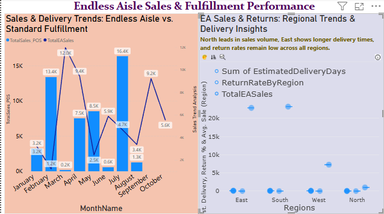
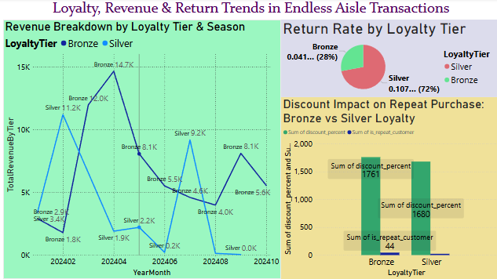
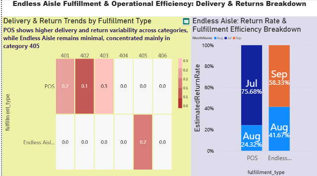

    
# **Endless Aisle’s Impact on Customer Satisfaction & Operational Efficiency**  

## **Section 1: The Business Goal**  
The objective of this project is to **analyze the performance of Endless Aisle fulfillment**, specifically its impact on **customer satisfaction and operational efficiency**.  

🚀 **This project explores how Endless Aisle affects customer satisfaction, return rates, and operational efficiency compared to POS fulfillment.** 

###  
📌 **Understanding Fulfillment Methods in Retail Supply Chain**  
Retail businesses rely on **different fulfillment methods** to ensure efficient product delivery and customer satisfaction. This project focuses on **Endless Aisle**, a fulfillment type where customers can order out-of-stock items via digital systems and have them shipped directly to their homes or a nearby store.  

To compare Endless Aisle's performance, we analyze it alongside **Point of Sale (POS) fulfillment**, where customers buy items in-store or through other traditional retail processes. Some businesses also adopt **Buy Online Pickup In Store (BOPIS)**, allowing customers to order online and pick up products at a physical location.  

📌 **Why Endless Aisle Matters?**  
✔ **Enhances customer satisfaction** → Avoids out-of-stock frustration.  
✔ **Improves inventory management** → Enables better demand tracking.  
✔ **Reduces operational inefficiencies** → Eliminates issues tied to abandoned in-store pickups (seen in BOPIS).   

### **Why This Goal Matters?**  
✔ **Personal Experience Insight:** Drawing from hands-on knowledge in **Supply Chain Management**, including working on a **FAANG Retail Store project**, this study explores why **Endless Aisle succeeded** where **BOPIS failed** in fulfillment logistics.  
✔ **Strategic Business Application:** Evaluating **sales, loyalty-based revenue, discount-driven purchase behavior, and operational efficiency metrics** provides actionable insights for retail optimization.  
✔ **Scaling Opportunities:** Identifying **high-performing regions & reducing fulfillment bottlenecks** can refine Endless Aisle strategies for better **customer retention & satisfaction**.  

## **Section 2: Data Source**  
✔ **Primary Data:** Retail store transactional records detailing fulfillment types (Endless Aisle vs. Standard).  
✔ **Customer Data:** Loyalty segmentation, discount usage, repeat purchases.  
✔ **Sales Metrics:** Monthly revenue, order volume, seasonal purchase trends.  
✔ **Fulfillment & Logistics Metrics:** Delivery times, return rates, inventory movement.  
✔ **Source Format:** Extracted from **structured SQL databases and processed via CSV**.  

## **Section 3: Tools Used**  
✔ **ETL Processing:** SQL for schema refinement, column transformations.  
✔ **Data Cleaning & Aggregation:** Python (Pandas) for handling missing values.  
✔ **Visualization:** Power BI for dynamic charts and dashboards.  
✔ **Analysis Methods:** DAX calculations for return rate estimates, fulfillment trends.  

## **Section 4: Workflow & Logic**  
### **ETL Refinements & Column Modifications**  
✔ Adjusted **schema for compatibility** with analysis goals.  
✔ **Inserted synthetic columns in the Sale Table:**  
- **DiscountPercent** → To analyze the effect of discounts on purchase behavior.  
- **FulfillmentType** → To differentiate between Endless Aisle vs. Standard fulfillment.  
- **IsRepeatCustomer** → To measure retention and loyalty trends.  
- **AnomalyFlag** → To flag unusual purchase patterns (like extreme discount usage).  

✔ **Inserted synthetic columns in the Product Table:**  
- **Brand** → To evaluate product loyalty and brand preferences.  
- **Stock_Quantity** → To identify fulfillment bottlenecks and inventory gaps.  
- **Product_Category** → To categorize products for trend analysis by fulfillment type.  

✔ **Repopulated the Data Warehouse** to ensure **alignment with project objectives** and meaningful comparisons between fulfillment methods. 

 # Run the Python Script for Repopulating the DW
python scripts/enhanced_etl_to_dw.py

### **Data Breakdown & Visual Representation**  
✔ **Dimension Analysis:**  
- **Fulfillment Type** → Endless Aisle vs. Standard.  
- **Region & Product Category** → Location-based trends.  
- **Customer Loyalty Tier** → Adoption & satisfaction.  
- **Order Month/Season** → Demand spikes.  

✔ **Numeric Metrics:**  
- **Avg. Delivery Time** → Operational efficiency gauge.  
- **Return Rate** → Success measurement of fulfillment methods.  
- **Order Volume & Avg. Sale Amount** → Customer behavior insight.  
- **Repeat Purchase Rate** → Loyalty-driven retention metric.  

✔ **Slicing & Dicing Strategy:**  
Grouped by **fulfillment type, region, category, and time segments** to uncover patterns.  

✔ **Drilldown Insights:**  
Analyzed **high-performing regions/products, return reasons, and loyalty-based purchase behaviors** for deeper strategic insights.  

## **Section 5: Results (Narrative + Visualizations)**  
✔ **Endless Aisle drives higher repeat purchases**, particularly among Silver-tier customers.  
✔ **BOPIS failure confirms the importance of smooth fulfillment without requiring in-store pickups.**  
✔ **Delivery delays correlate directly with increased return rates**, especially in the East region.  
✔ **Discount-driven purchases show increased returns in Bronze-tier customers but retain Silver-tier buyers.  
✔ **Bulk preorders via Endless Aisle spike seasonal sales but require refined logistics planning.**  

### **Final Power BI Dashboard Groupings**  
**Dashboard 1:** **Sales & Fulfillment Overview** (EA vs. Standard) 

**Dashboard 2:** **Loyalty-Based Revenue & Discount Impact** 

**Dashboard 3:** **Operational Efficiency & Return Rate Analysis** 

## **Section 6: Suggested Business Actions**  
✔ **Optimize fulfillment logistics** in high-delay regions to **reduce return rates.**  
✔ **Adjust discount strategies** to **retain high-value customers while minimizing returns.**  
✔ **Scale Endless Aisle in strong-performing regions** to **increase order efficiency.**  
✔ **Target high-loyalty customers** for **exclusive fulfillment-based promotions.**  

## **Section 7: Challenges**  
✔ **Simulating realistic delivery time estimates** due to missing data points.  
✔ **Ensuring clarity in defining Endless Aisle’s impact** for a general audience.  
✔ **Refining Power BI filters and metrics** to **accurately reflect fulfillment trends.**  
✔ **Addressing schema conflicts in the database** during ETL transformations.  

## **Section 8: Ethical Considerations**  
✔ **Data privacy compliance:** Avoiding personal identifiers in customer analysis.  
✔ **Bias mitigation:** Ensuring fulfillment insights are balanced across regions.  
✔ **Preventing misinterpretation of discount-driven returns:** Ensuring **accurate segmentation** before making business decisions.  

# Push updates to Remote Repository
git add .
git commit -m "Completed custom BI project"
git push -u origin main

## Acknowledgements

Special Thanks To:
Dr.Case for her guidance and support
Open Source Contributors for essential license and tools. 

### ✅ **Future Enhancements**  

🔹 **1. Expand to Multi-Fulfillment Comparison** → Instead of just EA vs. POS, include insights on other models like **Ship from Store** or **Marketplace Fulfillment** to see broader industry trends.  

🔹 **2. Predictive Modeling for Demand & Returns** → Use **machine learning** to forecast return rates based on fulfillment type, product category, and regional demand patterns.  

🔹 **3. Integration of Real-Time Data Streams** → Enhance operational efficiency metrics by pulling **live fulfillment data** rather than relying solely on static historical records.  

🔹 **4. Advanced Anomaly Detection** → Improve the **AnomalyFlag metric** by integrating **pattern recognition** to automatically flag irregular trends affecting returns.  

🔹 **5. Deep Dive into Customer Sentiment Analysis** → Add **customer feedback** alongside transaction data to gauge **satisfaction beyond return rates and fulfillment speed**.  

🔹 **6. Personalized Discount Optimization** → Use **loyalty-tier-specific pricing strategies** to analyze **which discounts truly drive retention rather than increasing returns**.  

🔹 **7. Ethical & Sustainability Considerations** → Track how **Endless Aisle impacts waste management & carbon footprint** compared to other fulfillment methods.  

